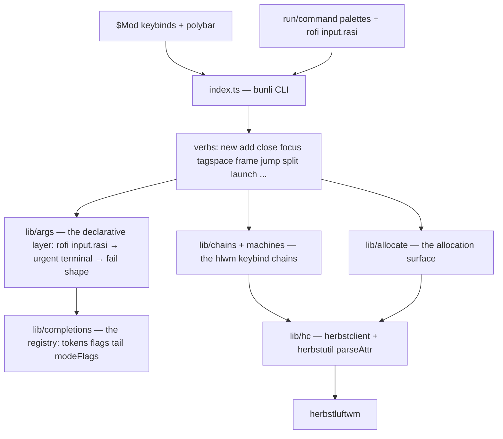
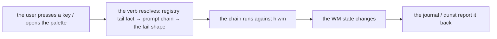

# herbctl — structural + logical

## structural

```mermaid
graph TD
    KEY[$Mod keybinds + polybar] --> IDX[index.ts — bunli CLI]
    PALETTE[run/command palettes + rofi input.rasi] --> IDX
    IDX --> CMDS[verbs: new add close focus tagspace frame jump split launch ...]
    CMDS --> ARGS[lib/args — the declarative layer: rofi input.rasi → urgent terminal → fail shape]
    CMDS --> CHAINS[lib/chains + machines — the hlwm keybind chains]
    CMDS --> ALLOC[lib/allocate — the allocation surface]
    ARGS --> COMP[lib/completions — the registry: tokens flags tail modeFlags]
    CHAINS --> HC[lib/hc — herbstclient + herbstutil parseAttr]
    ALLOC --> HC
    HC --> WM[herbstluftwm]
```

## logical

```mermaid
flowchart LR
    U[the user presses a key / opens the palette] --> V[the verb resolves: registry tail fact → prompt chain → the fail shape]
    V --> H[the chain runs against hlwm]
    H --> W[the WM state changes]
    W --> J[the journal / dunst report it back]
```
